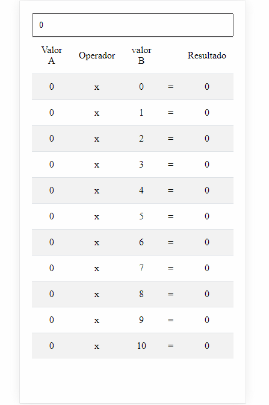

# Tabuada Dinamica

Técnicas de HTML, CSS e JavaScript

#

### HTML

Tags de tabelas

##

### CSS

Estilização de tabela

##

### JavaScript

Usando `For` clássico para estabelecer a tabela de 0 á 10 numeros.

---

#### Projeto :

